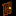
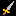

|Numéro|Symbole dans le .txt|Image|Résultat dans le jeu|
|------|--------------------|-----|--------------------|
| 0|` `||sol|
| 1|`@`||personnage|
| 2|`#`||mur plein carré|
| 3|`E`||escalier -> niveau++|
| 4|`o`||pomme|
| 5|`M`||monstre|
| 6|`P`||porte|
| 7|`h`||potion|
| 8|`!`||épée|
| 9|`$`||pièce|
|10|`L`||mur_coin_haut_droit|
|11|`/`||mur_coin_haut_gauche|
|12|`]`||mur_coin_bas_gauche|
|13|`[`||mur_coin_bas_droit|
|14|`T`||mur_T_normal|
|15|`t`||mur_T_inv|
|16|`{`||mur_T_droit|
|17|`}`||mur_T_gauche|
|18|`-`||mur horizontal|
|19|`I`||mur vertical|
|20|`&`||couloir|
|21|`_`||noir total|
|22|`c`||clé|
|23|`~`||eau|
|39|`:`||herbe|
|42|`>`||fusée|
|43|`g`||glace|
|45|`C`||coffre|
|46|`?`||case mystère|
|47|`n`||potion 2 pour nager|